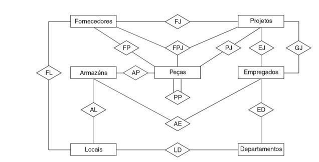

### 1.1 INTRODUÇÃO
- Um sistema de banco de dados é basicamente apenas um sistema computadorizado de manutenção de registros, onde usuários desse sitema podem acrescentar ou remover registros, ou inserir, buscar, excluir, alterar dados em registros existentes.  Sendo assim, um equivalente eletrônico de um armário de arquivamento.

- requisições em sistemas de banco de dados também são chamados de instruções, comandos ou operadores (operação é aquilo que é realizado quando o operador/comando/instução/requisição é invocado) tipo:  SELECT, INSERT, DELETE, UPDATE, que são expressas em um linguagem chamada SQL (Structured Query Language (síqual ou ésse-quê-éle) - Linguagem de Consulta Estruturada), originalmente uma linguagem própria da IBM, sendo agora um padrão internacional, aceito por praticamente todo produto disponível comercialmente.

- informalmente um banco de dados é formado por tabelas e cada linha dessa tabela é um registro e cada coluna um campo.  Sendo mais formal, é usado outro conjunto de termos: **relações, tuplas e atributos**.

- um campo pode conter variados tipos de dados (texto, numeros, imagens, sons, etc);

### 1.2 O que é um Sisteme de Banco de Dados

#### Minha definição
- **"Sistema de Banco de dados é uma coleção de informações organizadas de forma estruturada (adquirindo significado e utilidade), armazenadas, de forma persistente, e acessadas eletronicamente. Seu objetivo é permitir o armazenamento, a consulta, a atualização e o gerenciamento eficiente dessas informações, que representam e modelam algum aspecto do mundo real, com um propósito específico, não sendo assim, apenas um repositório de dados."**

- entre o banco de dados físico – ou seja, os dados fisicamente armazenados – e os usuários do sistema existe uma camada de software, conhecida como **gerenciador de banco de dados ou servidor de banco de dados** ou, mais frequentemente, como sistema de gerenciamento de bancos de dados (SGBD). Todas as requisições de acesso ao banco de dados são tratadas pelo SGBD.  Uma função geral fornecida pelo SGBD é, portanto, a de isolar os usuários do banco de dados dos detalhes no nível de hardware (assim como os sistemas de linguagens de programação isolam os programadores de aplicações dos detalhes no nível de hardware). Em outras palavras, o SGBD oferece aos usuários uma visão do banco de dados um tanto elevada acima do nível de hardware, e ele admite operações do usuário que são expressas em termos dessa visão de nível mais elevado.

- O SGBD é, de longe, o componente de software mais importante de todo o sistema, mas não é o único. Outros componentes incluem utilitários, ferramentas de desenvolvimento de aplicações, recursos para auxiliar no projeto, geradores de relatórios e (mais importante) o gerenciador de transações ou monitor de TP (Transaction Processing – processamento de transações).

- O termo SGBD também é usado para se referir genericamente a algum produto específico de algum fornecedor em particular – por exemplo, o produto DB2 Universal Database da IBM. O termo instância do SGBD, então, costuma ser usado para se referir à cópia específica de tal produto que está sendo executada em determinada instalação de computador. Como você certamente notará, às vezes é preciso distinguir cuidadosamente a diferença entre esses dois conceitos.

- é preciso saber que o pessoal da área frequentemente usa o termo banco de dados quando, na realidade, quer se referir ao SGBD (em qualquer um dos sentidos explicados anteriormente). Aqui está um exemplo típico: “O banco de dados do vendedor X superou o banco de dados do fornecedor Y por um fator de dois para um”. Esse uso é incorreto e desaconselhável, porém muito comum.
(O problema é que, se chamarmos o SGBD de banco de dados, como será chamado o próprio banco de dados?).

#### Usuários
 - há os programadores de aplicações, responsáveis pela escrita de programas de aplicações de bancos de dados em alguma linguagem de programação, como COBOL, PL/I, C++, Java ou alguma linguagem de alto nível de “quarta geração” (Consulte o Capítulo 2). Esses programas acessam o banco de dados emitindo a requisição apropriada (normalmente, uma instrução SQL) ao SGBD. Os programas propriamente ditos podem ser aplicações convencionais em batch ou, então, podem ser aplicações on-line, cuja finalidade é permitir que um usuário final acesse o banco de dados interativamente (por exemplo, a partir de uma estação de trabalho ou terminal on-line, ou de um microcomputador). A maioria das aplicações modernas é do tipo on-line.

 - existem os usuários finais, que acessam o banco de dados interativamente, como já dissemos. Determinado usuário final pode acessar o banco de dados por meio de uma das aplicações on-line ou, então, pode usar uma interface fornecida como parte integrante do software do sistema. Essas interfaces oferecidas pelo fornecedor são admitidas por meio de aplicações on-line, mas essas aplicações são internas (built-in), e não escritas pelo usuário. A maior parte dos sistemas inclui pelo menos uma aplicação interna, chamada processador de linguagem de consulta, por meio do qual o usuário pode emitir requisições ao banco de dados, como SELECT e INSERT, interativamente ao SGBD. SQL é um exemplo típico de uma linguagem de consulta de banco de dados. (A propósito, observe que o termo linguagem de consulta, embora comum, na realidade é mal utilizado, já que o verbo “consultar” sugere apenas busca, enquanto as linguagens de consulta normalmente (mas não sempre) oferecem também operações de atualização e outras. A maior parte dos sistemas também oferece outras interfaces internas, em que os usuários finais não emitem requisições específicas ao banco de dados, como SELECT e INSERT, mas operam, por exemplo, escolhendo itens de um menu ou preenchendo caixas em um formulário. Essas interfaces acionadas por menus ou por formulários costumam ter um uso mais fácil para pessoas que não possuem um treinamento formal em TI (Tecnologia da Informação; a abreviatura SI, Sistemas de Informação, também é usada com o mesmo sentido). Por outro lado, interfaces acionadas por comandos – ou seja, linguagens de consulta – costumam exigir uma certa experiência profissional em TI, embora talvez não muita (obviamente, não tanto quando é necessário para escrever um programa em uma linguagem como COBOL). Novamente, uma interface acionada por comandos talvez seja mais flexível do que uma acionada por menus ou formulários, no sentido de que as linguagens de consulta normalmente incluem certos recursos que não são admitidos por essas outras interfaces.

 - A terceira classe de usuários é o administrador de banco de dados, ou DBA (de Data Base Administrator).

### 1.3 O que é um Banco de Dados
#### Dados Persistentes
Por persistente, queremos sugerir intuitivamente que os dados desse banco de dados diferem em espécie de outros dados mais efêmeros, como dados de entrada, dados de saída, filas de trabalho, blocos de controle de software, instruções SQL, resultados intermediários e, de modo geral, quaisquer dados que tenham natureza transitória. Mais precisamente, dizemos que os dados no banco de dados “persistem” porque, uma vez aceitos pelo SGBD para entrada no banco de dados em primeiro lugar, eles só podem ser removidos do banco de dados mais tarde por alguma requisição explícita ao SGBD,e não como um mero efeito colateral de (por exemplo) algum programa concluindo sua execução. Essa noção de persistência, assim, nos permite oferecer uma definição um pouco mais precisa para o termo banco de dados:
- um banco de dados é uma coleção de dados persistentes, usada pelos sistemas de aplicação de uma determinada empresa.

#### Entidades e relacionamentos
- o termo entidade normalmente é usado na área de banco de dados para indicar qualquer objeto distinguível que deva ser representado no banco de dados (Fornecedor, Projetos, Armazéns, Peças, Empregaods, Locais, Departamentos).

- além das entidades básicas propriamente ditas (fornecedores, peças etc., no exemplo), haverá também relacionamentos interligando essas entidades básicas. Tais relacionamentos são representados por losangos e linhas de conexão. Por exemplo, há um relacionamento (“FP” ou remessas) entre fornecedores e peças: cada fornecedor remete certas peças e, inversamente, cada peça é fornecida por certos fornecedores (mais precisamente, cada fornecedor remete certos tipos de peças, e cada tipo de peça é fornecido por certos fornecedores). De modo semelhante, as peças são usadas em projetos, e os
projetos usam peças (relacionamento PJ); as peças são mantidas em armazéns, e os armazéns mantêm peças (relacionamento AP); e assim por diante. Observe que esses relacionamentos são todos bidirecionais – ou seja, eles podem ser percorridos em qualquer sentido. Por exemplo, o relacionamento FP, entre fornecedores e peças, pode ser usado para solucionar as duas situações a seguir:
  - Dado um fornecedor, obter as peças fornecidas por esse fornecedor;
  - Dada uma peça, obter os fornecedores que fornecem essa peça;

- O ponto significativo a respeito desse relacionamento (e de todos os outros ilustrados na figura) é que eles fazem parte dos dados tanto quanto as entidades básicas. Portanto, eles devem ser representados no banco de dados, assim como as entidades básicas.

- Embora a maior parte dos relacionamentos nessa figura envolva dois tipos de entidades – ou seja, eles são relacionamentos binários –, de modo algum podemos dizer que todos os relacionamentos são binários nesse sentido. No exemplo, existe um relacionamento (“FPJ”) envolvendo três tipos de entidade (fornecedores, peças e projetos): um relacionamento ternário. A interpretação pretendida é que certos fornecedores remetem certas peças para certos projetos. Observe cuidadosamente que esse relacionamento ternário (“fornecedores remetem peças a projetos”), em geral, não é equivalente à combinação dos três relacionamentos binários “fornecedores remetem peças”, “peças são usadas em projetos” e “projetos são remetidos pelos fornecedores”. Por exemplo, a afirmação de que Smith fornece chaves inglesas para o projeto Manhattan é mais informativa que as três declarações a seguir:
   - Smith fornece chaves inglesas
   - Chaves inglesas são usadas no projeto Manhattan
   - O projeto Manhattan é fornecido por Smith
Não podemos (de forma válida!) deduzir a conhecendo apenas b, c e d. Mais precisamente, se soubermos b, c e d, podemos deduzir que Smith fornece chaves inglesas a algum projeto (digamos, o projeto Jz), que algum fornecedor (digamos, o fornecedor Fx) fornece chaves inglesas para o projeto Manhattan, e que Smith fornece alguma peça (digamos, a peça Py) ao projeto Manhattan – mas não podemos deduzir de modo válido que Sx é Smith ou que Py é chaves inglesas ou que Jz éo projeto Manhattan. Deduções falsas como essas são exemplos do que algumas vezes se chama armadilha da conexão (connection trap).

- A figura também mostra um relacionamento (PP) envolvendo apenas um tipo de entidade (peças). O relacionamento aqui é que certas peças incluem outras peças como componentes imediatos (o relacionamento chamado lista de materiais – bill-of-materials); por exemplo, um parafuso é um componente de uma dobradiça, que também é uma peça e poderia ser um componente de alguma outra peça de nível mais alto, como uma tampa. Observe que esse relacionamento ainda é binário; simplesmente, os dois tipos de entidade envolvidos, peças e peças, são do mesmo tipo.

- Em geral, determinado conjunto de tipos de entidades poderia estar envolvido em qualquer quantidade de relacionamentos distintos. No exemplo da Figura, existem dois relacionamentos distintos envolvendo projeto e empregado: um deles (EJ) representa o fato de que os empregados são designados aos projetos, e o outro (GJ) representa o fato de que empregados gerenciam projetos.

- Agora, observamos que um relacionamento pode ser considerado uma entidade em si. Se tomarmos como nossa definição de entidade “qualquer objeto sobre o qual queremos registrar informações”, então um relacionamento certamente se encaixará na definição. Por exemplo, “a peça P4 está armazenada no armazém A8” é uma entidade sobre a qual poderíamos muito bem querer registrar informações – por exemplo, a quantidade correspondente. Além disso, há vantagens definidas que podem ser obtidas se não forem feitas distinções desnecessárias entre entidades e relacionamentos. Portanto, tentaremos tratar os relacionamentos simplesmente como um tipo especial de entidade.

